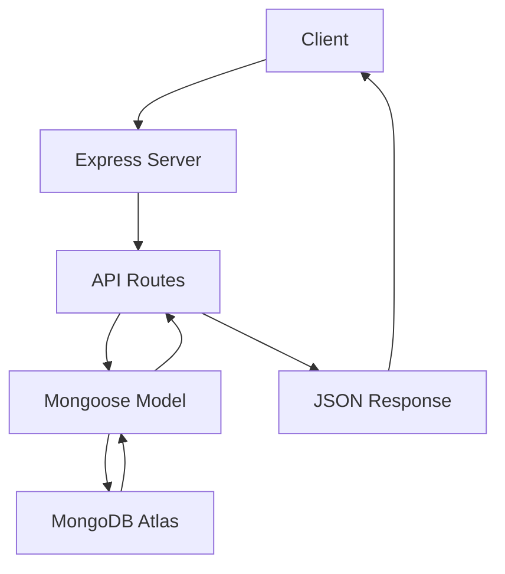

# Express User API Project

A RESTful API built with Node.js and Express, featuring full CRUD operations and live deployment.

This project evolved from a simple file-based API into a cloud-connected backend system using MongoDB Atlas, demonstrating real-world debugging, deployment, and security practices.

---


Author: Roland

---

## Live API

You can access the deployed API here:

https://express-user-api-2aws.onrender.com

Base URL:  
https://express-user-api-2aws.onrender.com

Example endpoint:  
https://express-user-api-2aws.onrender.com/users

API test route:  
https://express-user-api-2aws.onrender.com/api?name=Roland

Note:  
The live version may reset data due to free hosting limitations.

---

## Project Overview

This project started as a lightweight REST API using file-based storage (`users.json`) and was later upgraded to use MongoDB Atlas with Mongoose.

It now supports full CRUD operations with a cloud-hosted database.

The project demonstrates:

- Express server setup
- RESTful route design
- Query and route parameters
- JSON request handling
- Input validation
- Duplicate-name checking
- Transition from file storage to MongoDB
- API testing with Thunder Client

---

## Features

- Create new users → `POST /users`
- Retrieve all users → `GET /users`
- Retrieve a user by ID → `GET /users/:id`
- Update user information → `PUT /users/:id`
- Delete users → `DELETE /users/:id`
- Input validation prevents empty or missing names
- Duplicate user prevention is case-insensitive
- Cloud-based data storage using MongoDB Atlas

---

## Tech Stack

- Backend: Node.js, Express.js
- Database: MongoDB Atlas, Mongoose
- Testing: Thunder Client
- Deployment: Render
- Tools: VS Code, PowerShell

---

## Technologies Used

- Node.js → https://nodejs.org/
- Express.js → https://expressjs.com/
- JSON → https://www.json.org/json-en.html
- Visual Studio Code → https://code.visualstudio.com/
- Windows 11 → https://www.microsoft.com/windows/windows-11
- PowerShell → https://learn.microsoft.com/powershell/
- Thunder Client → https://www.thunderclient.com/
- Render → https://render.com/

---

## Screenshots

### Get All Users


### Create User Request


### Live API in Browser


---

## How It Works



---

## Architecture Evolution

### Version 1 (Initial Build)
- Data stored in `users.json`
- Simple file read/write operations
- No database dependency

### Version 2 (Current)
- Migrated to MongoDB Atlas
- Uses Mongoose for data modeling
- Cloud-based persistent storage
- Improved scalability and structure

---

## API Endpoints
### Base URL (Local)

http://localhost:3000

### Base URL (Live)

https://express-user-api-2aws.onrender.com

### Home Route

GET /
Example: http://localhost:3000/

### About Route

GET /about
Example: http://localhost:3000/about

### Get All Users

GET /users
Example: http://localhost:3000/users

### Get User by ID

GET /users/:id
Example: http://localhost:3000/users/1

### Create User

POST /users

Example request body:

{
  "name": "Test"
}

Example Response 

```json
{
  "_id": "661234abcd1234",
  "name": "Test",
  "createdAt": "...",
  "updatedAt": "..."
}
```

## Running the Application Locally

### Quick Start

```
npm install
```

```
node server.js
```

### Manual Setup
1. Clone the repository:

git clone https://github.com/rpratts1/express-user-api.git

2. Navigate to the project folder:

```
cd express-user-api
```

3. Install dependencies:

```
npm install
```

4. Start the server:

```
node server.js 
```

5. Open in browser:

http://localhost:3000

----


## Project Files

### `server.js`
Main application file containing:
- Express setup
- Routes
- Validation
- File reading and writing
- CRUD operations

### users.json (Legacy)
Previously used for file-based storage in Version 1.

### `package.json`
Stores project metadata and dependencies.

### `.gitignore`
Prevents unnecessary files like `node_modules` from being uploaded.

---

## GitHub Repository

https://github.com/rpratts1/express-user-api

---

## Future Improvements

These improvements are planned to make the project more production-ready and scalable.

### Major Planned Upgrades
- Expand MongoDB schema for more complex data
- Add JWT authentication for secure login and protected routes

### Backend Enhancements
- Use `.env` for configuration management
- Add centralized error handling middleware
- Improve validation using Joi or Express Validator

### Security Improvements
- Implement password hashing with bcrypt
- Add rate limiting
- Use Helmet for secure HTTP headers
- Configure CORS properly

### Performance & Scalability
- Add database indexing
- Implement caching
- Prepare app for Docker deployment

### Developer Experience
- Add logging (Morgan/Winston)
- Write unit and integration tests (Jest/Mocha)
- Document API with Swagger

### Frontend Integration
- Build React frontend
- Create user dashboard
- Convert to full-stack application

### Deployment & DevOps
- Set up CI/CD pipelines
- Add monitoring and uptime tracking
- Deploy to AWS or Azure

## Security Note

Sensitive data such as database credentials are stored in environment variables using `.env` and are not committed to GitHub.

Previously exposed credentials were rotated and removed to follow best security practices.

---

## Skills Demonstrated

- REST API design
- CRUD operations
- MongoDB Atlas integration
- Environment variable management (.env)
- Debugging network and authentication issues
- API testing (Thunder Client)
- Cloud deployment (Render)
- Git & GitHub version control

---

## What I Learned
- Built a REST API using Node.js and Express
- Implemented CRUD operations
- Handled JSON file-based storage
- Performed API testing using Thunder Client
- Deployed a live API using Render
- Managed version control using Git and GitHub

---

## Why This Project Matters

This project demonstrates:
- Backend API development
- RESTful design principles
- Data validation and error handling
- Real-world deployment workflow
- Version control using Git and GitHub

---

## Development Journey

This project was more than just building an API—it was a hands-on learning experience in real-world backend development using Node.js, Express, and MongoDB Atlas.

### What I Built

I created a RESTful API that supports full CRUD operations:

- Create users (POST)
- Read all users (GET)
- Read a single user by ID (GET)
- Update users (PUT)
- Delete users (DELETE)

The API is connected to a cloud-hosted MongoDB database using Mongoose.

---

### Challenges I Faced

During development, I encountered several real-world issues:

- MongoDB connection errors (`ECONNREFUSED`)
- Authentication failures (`bad auth`)
- Incorrect connection string formats
- Environment variable misconfiguration (`.env`)
- Accidentally exposing credentials to GitHub
- IP access configuration in MongoDB Atlas

---

### How I Solved Them

- Fixed connection string using proper MongoDB URI format
- Updated database user credentials and rotated passwords
- Configured IP access in MongoDB Atlas (`0.0.0.0/0` for testing)
- Used `dotenv` to securely manage environment variables
- Removed `.env` from GitHub and added it to `.gitignore`
- Verified DNS resolution using `nslookup`
- Tested endpoints using Thunder Client in VS Code

---

### What I Learned

This project helped me understand:

- How backend APIs actually connect to cloud databases
- The importance of environment variables and security
- How to debug real connection and authentication issues
- How to test APIs using tools like Thunder Client
- How to structure a Node.js + Express + MongoDB application

---

### Key Takeaway

Building this project showed me that backend development is not just about writing code—it’s about troubleshooting, debugging, and understanding how different systems work together.

---

### Next Steps

I plan to continue improving this project by adding:

- User authentication (JWT)
- Password hashing (bcrypt)
- Input validation
- Error handling improvements
- Protected routes