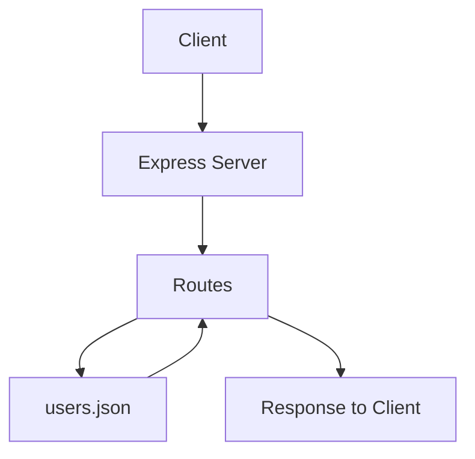

# Express User API Project

A RESTful API built with Node.js and Express, featuring full CRUD operations and live deployment.


Author: Roland

---

## Live API

You can access the deployed API here:

https://express-user-api-2aws.onrender.com

Base URL:  
https://express-user-api-2aws.onrender.com

Example endpoint:  
https://express-user-api-2aws.onrender.com/users

API test route:  
https://express-user-api-2aws.onrender.com/api?name=Roland

Note:  
The live version may reset data due to free hosting limitations.

---

## Project Overview

This project is a lightweight REST API built with Node.js and Express. It supports full CRUD operations for users and stores user data in a local JSON file.

The project demonstrates:
- Express server setup
- Route creation
- Query parameters
- Route parameters
- JSON request handling
- Input validation
- Duplicate-name checking
- File-based persistence using `users.json`
- API testing with Thunder Client

---

## Features

- Create new users → `POST /users`
- Retrieve all users → `GET /users`
- Retrieve a user by ID → `GET /users/:id`
- Update user information → `PUT /users/:id`
- Delete users → `DELETE /users/:id`
- Input validation prevents empty or missing names
- Duplicate user prevention is case-insensitive
- File-based data storage using JSON

---

## Technologies Used

- Node.js → https://nodejs.org/
- Express.js → https://expressjs.com/
- JavaScript
- JSON → https://www.json.org/json-en.html
- Visual Studio Code → https://code.visualstudio.com/
- Windows 11 → https://www.microsoft.com/windows/windows-11
- PowerShell → https://learn.microsoft.com/powershell/
- Thunder Client → https://www.thunderclient.com/
- Render → https://render.com/

---

## Screenshots

### Get All Users


### Create User Request


### Live API in Browser


---

## How It Works



---

## Project Files

### `server.js`
Main application file containing:
- Express setup
- Routes
- Validation
- File reading and writing
- CRUD operations

### `users.json`
Stores the saved users in JSON format.

### `package.json`
Stores project metadata and dependencies.

### `.gitignore`
Prevents unnecessary files like `node_modules` from being uploaded.

---

## API Endpoints

### Base URL (Local)
`http://localhost:3000`

### Base URL (Live)
`https://express-user-api-2aws.onrender.com`

### Home Route
`GET /`  
Example: `http://localhost:3000/`

### About Route
`GET /about`  
Example: `http://localhost:3000/about`

### Get All Users
`GET /users`  
Example: `http://localhost:3000/users`

### Get User by ID
`GET /users/:id`  
Example: `http://localhost:3000/users/1`

### Create User
`POST /users`

### Example Response

```json
[
  {
    "id": 1,
    "name": "Test"
  }
]
```
---

## Running the Application Locally

### Quick Start

1. Clone the repository:

```bash 
git clone https://github.com/rpratts1/express-user-api.git
```

2. Navigate to the project folder:

```bash
cd express-user-api
```

3. Install dependencies:

```bash
npm install
```

4. Start the server:

```bash
node server.js
```

5. Open in browser:

http://localhost:3000


---

## GitHub Repository

https://github.com/rpratts1/express-user-api

--- 

## Future Improvements

These improvements are planned to make the project more production-ready and scalable.

### Major Planned Upgrades
- Implement MongoDB to replace JSON file storage
- Add JWT authentication for secure login and protected routes

### Backend Enhancements
- Use `.env` for configuration management
- Add centralized error handling middleware
- Improve validation using Joi or Express Validator

### Security Improvements
- Implement password hashing with bcrypt
- Add rate limiting
- Use Helmet for secure HTTP headers
- Configure CORS properly

### Performance & Scalability
- Add database indexing
- Implement caching
- Prepare app for Docker deployment

### Developer Experience
- Add logging (Morgan/Winston)
- Write unit and integration tests (Jest/Mocha)
- Document API with Swagger

### Frontend Integration
- Build React frontend
- Create user dashboard
- Convert to full-stack application

### Deployment & DevOps
- Set up CI/CD pipelines
- Add monitoring and uptime tracking
- Deploy to AWS or Azure

## What I Learned
- Built a REST API using Node.js and Express
- Implemented CRUD operations
- Handled JSON file-based storage
- Performed API testing using Thunder Client
- Deployed a live API using Render
- Managed version control using Git and GitHub

## Why This Project Matters

This project demonstrates:
- Backend API development
- RESTful design principles
- Data validation and error handling
- Real-world deployment workflow
- Version control using Git and GitHub

